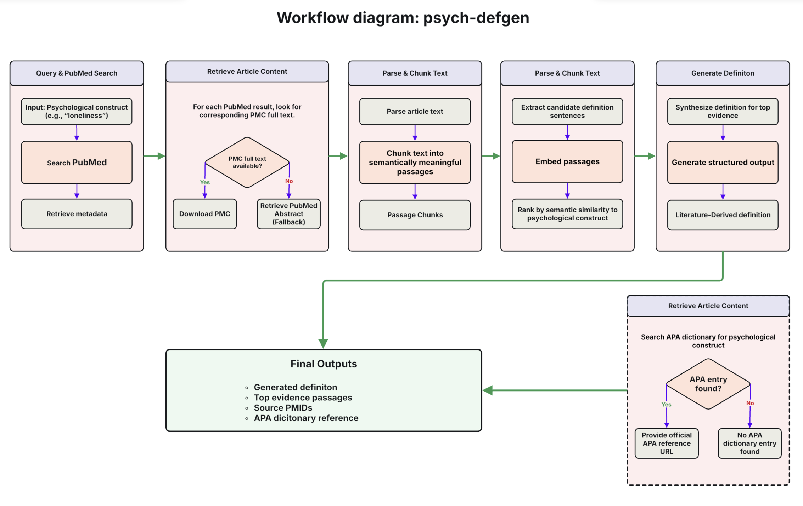

# Psychological Construct Definition Generator

Psychological Construct Definition Generator is a Python package for generating evidence-based ontology-style definitions of psychological constructs from PubMed and PubMed Central (PMC) literature.


## Overview

The package implements a retrieval-augmented generation (RAG) workflow that searches the biomedical literature for a target psychological construct, retrieves relevant PubMed abstracts and PubMed Central (PMC) full-text articles, extracts candidate definition statements, ranks evidence using semantic similarity, and generates a concise evidence-based definition suitable for ontology development and expert curation. The APA Dictionary of Psychology is used only to verify and reference existing dictionary entries. APA content is not used to generate the literature-derived definition.

## Workflow



## Features


- Search PubMed for articles related to a psychological construct.
- Retrieve full-text articles from PubMed Central (PMC), when available.
- Retrieve PubMed abstracts as fallback evidence.
- Extract candidate definition statements.
- Chunk and prepare retrieved evidence for semantic retrieval.
- Perform semantic retrieval using sentence-transformer embeddings.
- Rank evidence passages by semantic relevance.
- Generate ontology-style definitions.
- Verify APA Dictionary entries and provide the official reference URL when available.
- Export definitions and supporting evidence as Markdown.


---

## Installation


```bash
pip install psych-defgen
playwright install chromium
```


## Verify Installation


```bash
python -c "import psych_defgen; print('Package installed successfully')"
```

## Development Installation

To install development version from GitHub:


```bash
git clone https://github.com/uflcod/psych-defgen.git
cd psych-defgen

pip install -e .
playwright install chromium

```

Editable installation allows you to make changes to the source code and use them immediately without reinstalling the package.


---

# Configure NCBI Credentials

This package uses the NCBI Entrez API to retrieve PubMed and PubMed Central articles. An NCBI email address is required to access the NCBI Entrez API. You can provide your credentials either through environment variables or as command-line arguments.

## Option 1: Environment variables (recommended)

### macOS / Linux

```bash
export NCBI_EMAIL="YOUR_NCBI_EMAIL"
```

### Windows PowerShell

```powershell
$env:NCBI_EMAIL="YOUR_NCBI_EMAIL"
```

Replace `YOUR_NCBI_EMAIL` with your own email address.

For higher request limits, you may optionally configure an NCBI API key.

### macOS / Linux

```bash
export NCBI_API_KEY="YOUR_API_KEY"
```

### Windows PowerShell

```powershell
$env:NCBI_API_KEY="YOUR_API_KEY"
```

If no API key is provided, the package uses the standard NCBI request limits.

## Option 2: Command-line arguments

Instead of environment variables, you can provide your NCBI email directly when running the program:

```bash
psych-defgen loneliness \
    --email YOUR_NCBI_EMAIL
```

To also use an NCBI API key:

```bash
psych-defgen loneliness \
    --email YOUR_NCBI_EMAIL \
    --api-key YOUR_API_KEY
```

If both environment variables and command-line arguments are provided, the command-line arguments take precedence.

> **Note**
>
> The package does **not** store or transmit your email address or API key except when making requests to the official NCBI Entrez API. These credentials are used only to identify your requests in accordance with NCBI API guidelines.

---

# Usage

Generate a definition for a psychological construct:

```bash
psych-defgen loneliness
```

Alternatively, specify your NCBI email directly:

```bash
psych-defgen loneliness \
    --email YOUR_NCBI_EMAIL
```

Multi-word constructs are supported:

```bash
psych-defgen "social vulnerability"
```

Specify the number of retrieved articles and evidence passages:

```bash
psych-defgen loneliness \
    --max-results 20 \
    --top-k 5
```

Specify a custom output file:

```bash
psych-defgen loneliness \
    --output results/loneliness_definition.md
```

The NCBI email can be combined with other options:

```bash
psych-defgen loneliness \
    --email YOUR_NCBI_EMAIL \
    --max-results 20 \
    --top-k 5 \
    --output results/loneliness_definition.md
```

Display all available command-line options:

```bash
psych-defgen --help
```

---

# Output


By default, generated definitions are saved as Markdown files in the `outputs` directory. A custom output file can be specified using the `--output` option.


```text
outputs/loneliness_definition.md
```

The output filename is automatically generated from the requested psychological construct.

---

# Requirements

- Python 3.11+
- Valid NCBI email address
- Chromium browser installed thorugh Playwright

Install the required Playwright browser with 

```bash
playwright install chromium
```


An NCBI API key is optional but recommended for higher request rate limits.

---

# License

This project is licensed under the MIT License. 

# Citation

Citation information will be provided upon publication of the accompanying manuscript.